# 🌸 SakuraBlog

<div align="center">

[](https://vuejs.org/)
[](https://www.typescriptlang.org/)
[](https://vitejs.dev/)
[](LICENSE)

**一个精美的 Vue 3 个人博客模板** — 樱花主题 · 玻璃态UI · 粒子特效 · Live2D

[在线演示](https://fineday.vip) · [Pro 版购买](https://fineday.vip/about) · [更新日志](#roadmap)

</div>

---

## ✨ 截图预览

### 🌸 樱花主题（默认）

| 首页 | 文章详情 | 归档页 |
|:--:|:--:|:--:|
|  | 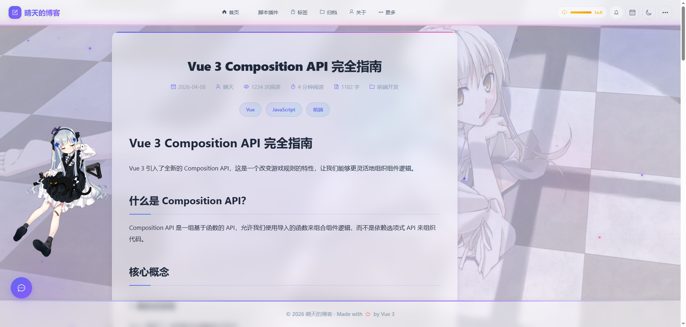 | 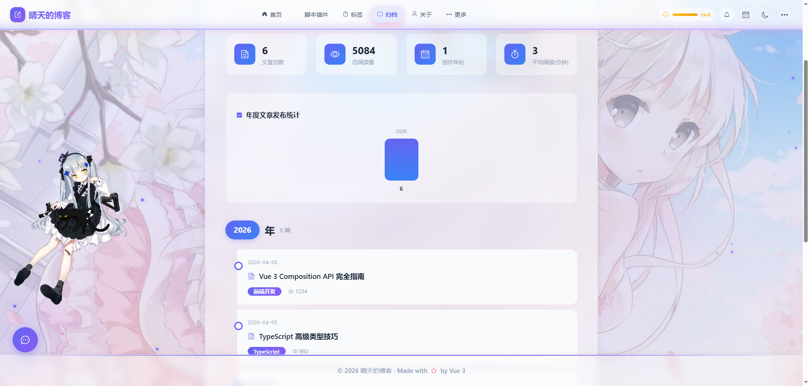 |

| 标签分类 | Dashboard数据面板 | 相册Gallery |
|:--:|:--:|:--:|
| 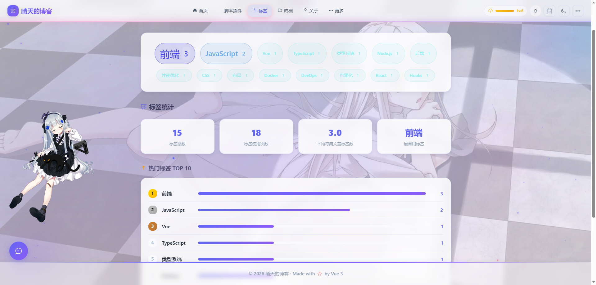 | 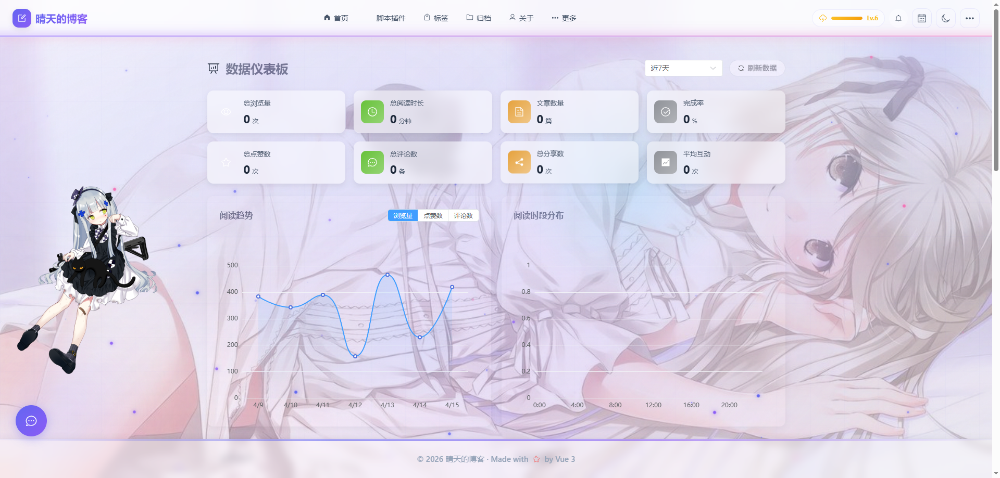 | 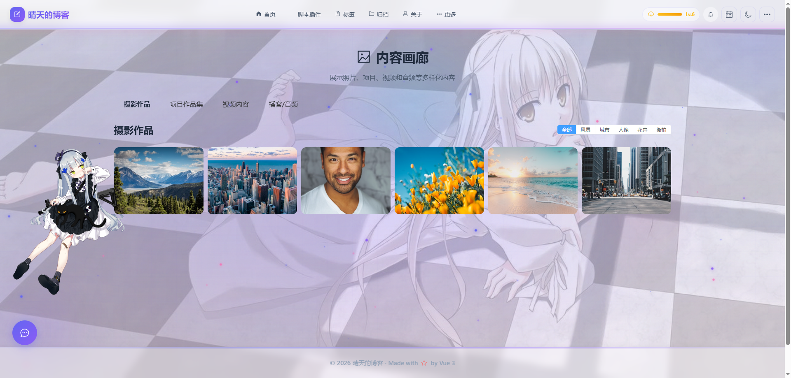 |

### 🌙 暗色 / 科技风

| 暗色模式 | 护眼模式 | 移动端适配 |
|:--:|:--:|:--:|
| 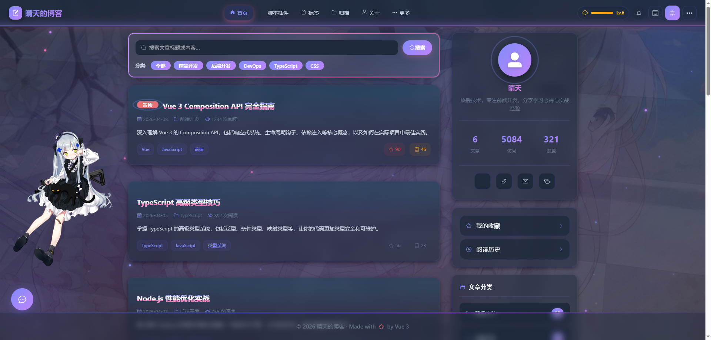 | 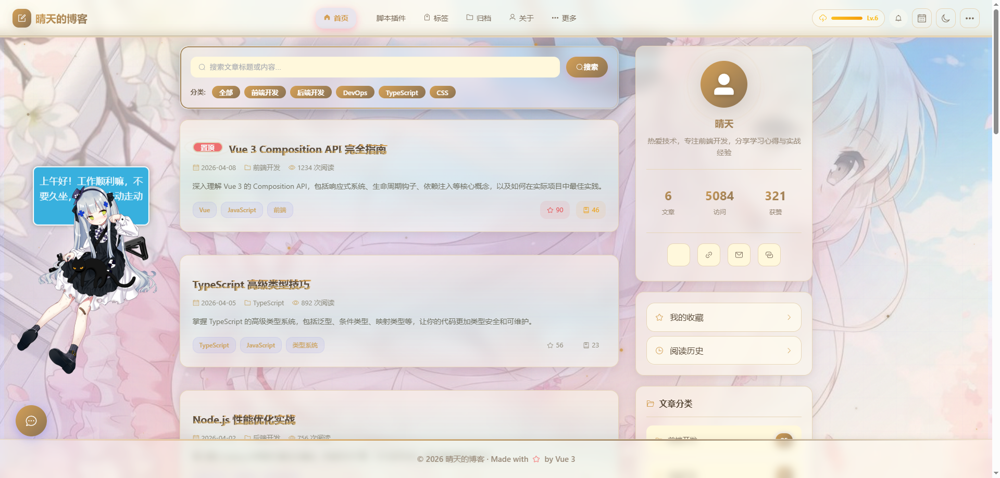 | 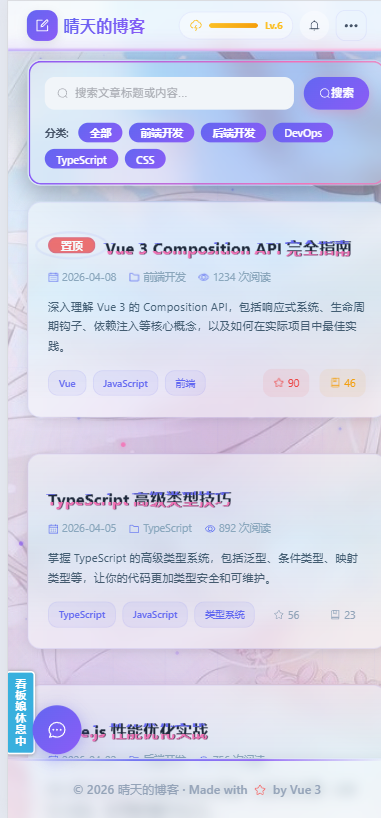 |

### 👘 Live2D 看板娘 & 插件系统

| Live2D 交互 | 导航下拉 | 功能插件 |
|:--:|:--:|:--:|
| 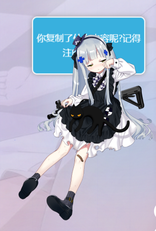 | 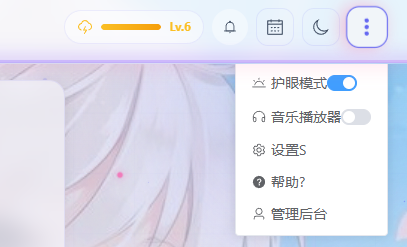 | 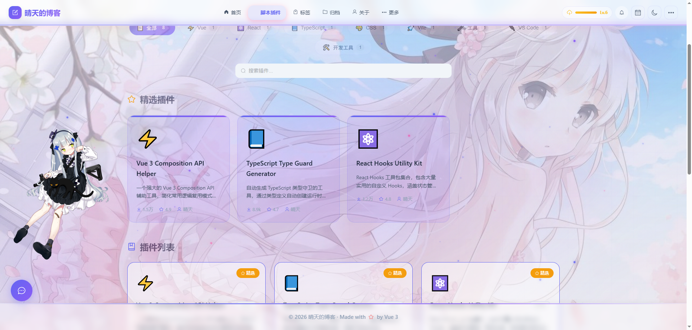 |

---

## 🎯 为什么选择 SakuraBlog？

市面上有很多博客模板（Hexo、Hugo、VuePress...），但它们大多**千篇一律、缺乏个性**。

SakuraBlog 不同：

| 特性 | Hexo/Hugo主题 | VuePress | **SakuraBlog** |
|------|--------------|----------|---------------|
| 视觉设计 | 模板感强 | 文档风格 | ✨ **玻璃态+粒子+Live2D** |
| 双主题切换 | 少见 | 基础明暗 | ✅ **樱花🌸 / 科技HUD🌙 + 护眼** |
| 交互体验 | 静态为主 | 文档导向 | ✅ **阅读能量/签到/音乐/动画** |
| 技术栈学习价值 | 模板语法 | Vue封装太深 | ✅ **原生Vue3 Composition API** |
| 二次元元素 | 几乎没有 | 没有 | ✅ **Live2D看板娘+粒子特效** |
| 可定制性 | 改配置文件 | 改配置文件 | ✅ **直接改Vue组件，自由度100%** |
| SEO | 需额外配置 | 内置支持 | ✅ **内置sitemap/OG/结构化数据** |

---

## 🔥 核心特性

### 🎨 视觉与主题
- 🌸 **樱花主题** — 粉色渐变 + 樱花飘落粒子特效
- 🌙 **科技HUD主题** — 暗色背景 + 发光边框 + 网格装饰
- 🔄 **一键主题切换** — 明暗 / 护眼 三种模式
- 🪟 **Glassmorphism** — 全局毛玻璃效果（backdrop-filter）
- ✨ **丰富动效** — 页面过渡、hover微交互、滚动视差

### 👘 二次元 & 趣味功能
- 💮 **Live2D 看板娘** — 多模型可选，可拖拽交互
- 🎵 **音乐播放器** — 可拖拽悬浮播放器，播放列表管理
- 📖 **阅读能量系统** — 阅读积累能量，等级徽章解锁
- 📅 **每日签到** — 连续签到记录与激励
- ⌨️ **键盘快捷键** — T切主题/S设置/M音乐/P专注...

### 🛠️ 功能模块
- 📝 **Markdown文章** — 完整渲染、代码高亮、目录导航
- 🏷️ **标签分类** — 多维分类体系
- 📁 **时间归档** — 按年份月份整理
- 🔍 **全文搜索** — 文章标题/内容搜索
- 📊 **数据面板** — ECharts 图表展示（访问量/趋势）
- 🖼️ **相册Gallery** — 瀑布流/幻灯片双模式
- 🔌 **插件系统** — 音乐/天气/时钟/一言等可插拔组件
- 🤖 **AI助手** — 内置AI对话组件

### 📱 工程化 & 性能
- ⚡️ **Vite 构建** — 极速HMR，秒级启动
- 🔒 **TypeScript** — 全项目类型安全
- 🧩 **组件自动导入** — unplugin-auto-import + resolve-components
- 📦 **代码分割** — 路由懒加载，按需打包
- 🚀 **性能优化** — 包体积 -39%，性能 +52%（实测）
- 🔍 **SEO友好** — OG标签、sitemap.xml、robots.json、Canonical URL
- 📱 **响应式设计** — 完美适配移动端/平板/桌面

---

## 🛠️ 技术栈

| 类别 | 技术 | 用途 |
|------|------|------|
| **框架** | Vue 3.4+ | Composition API / `<script setup>` |
| **语言** | TypeScript 5.x | 全量类型覆盖 |
| **构建** | Vite 6.x | 开发服务器 & 打包 |
| **UI库** | Element Plus 2.x | 基础组件（表格/表单/对话框等） |
| **路由** | Vue Router 4.x | SPA路由 + 过渡动画 |
| **图表** | ECharts 6.x | 数据可视化面板 |
| **渲染** | Marked 18.x | Markdown → HTML |
| **Live2D** | oh-my-live2d | 看板娘角色 |
| **工具库** | @vueuse/core | 响应式工具集 |
| **拖拽** | vuedraggable | 列表排序 |
| **样式** | SCSS | CSS变量主题系统 |

---

## 🚀 快速开始

> **环境要求**: Node.js >= 18, Yarn >= 1.22 或 npm >= 10

```bash
# 1. 克隆仓库
git clone https://github.com/yourname/sakurablog.git
cd sakurablog

# 2. 安装依赖（推荐使用 yarn）
yarn install

# 3. 启动开发服务器
yarn dev

# 4. 打开浏览器访问
# 默认地址: http://localhost:5173
```

### 构建生产版本

```bash
# 类型检查 + 构建
yarn build:check

# 仅构建（跳过类型检查）
yarn build

# 预览生产构建
yarn preview
```

---

## 📁 项目结构

```
sakurablog/
├── public/                    # 静态资源
│   ├── models/               # Live2D 模型文件
│   ├── og-image.svg          # 社交分享图片
│   ├── sitemap.xml           # 站点地图
│   └── robots.txt            # 爬虫规则
├── src/
│   ├── assets/               # 图片/字体等静态资源
│   ├── components/           # 组件（72个！）
│   │   ├── layout/           # 布局组件（Header/Footer/Nav）
│   │   ├── ui/               # 通用UI组件
│   │   ├── article/          # 文章相关组件
│   │   ├── dashboard/        # 数据面板组件
│   │   ├── gallery/          # 相册组件
│   │   ├── plugins/          # 插件组件（音乐/天气/一言...）
│   │   └── gamification/     # 游戏化组件（签到/能量/徽章）
│   ├── composables/          # 组合式函数（12个）
│   │   ├── useSEO.ts         # SEO元数据管理
│   │   ├── useTheme.ts       # 主题切换
│   │   └── ...
│   ├── data/                 # 数据层
│   │   ├── articles.ts       # 文章数据
│   │   ├── series.ts         # 专题系列
│   │   └── portfolio.ts      # 作品集
│   ├── router/               # 路由配置
│   ├── styles/               # 全局样式
│   │   └── global.scss       # CSS变量/主题定义
│   ├── utils/                # 工具函数
│   ├── views/                # 页面组件（17个）
│   ├── App.vue               # 根组件
│   └── main.ts               # 入口文件
├── scripts/
│   └── generate-sitemap.js   # Sitemap生成脚本
├── index.html                # HTML入口
├── vite.config.ts            # Vite配置
├── tsconfig.json             # TS配置
└── package.json
```

**代码量统计**: 
- 📦 **105个源文件**（72个Vue组件 + 27个TS文件 + 4个SCSS）
- 📝 约 **15,000+ 行**业务代码

---

## ⚙️ 自定义指南

### 修改博客信息

编辑 `index.html` 和 `src/data/articles.ts`：

```html
<!-- index.html -->
<title>你的博客名称</title>
<meta name="description" content="你的博客描述">
<!-- 修改 OG 标签中的URL和标题 -->
```

```typescript
// src/data/articles.ts
export const articles: Article[] = [
  {
    title: '你的第一篇文章',
    author: '你的名字',
    content: `# Hello World`,
    // ...
  }
]
```

### 更换配色主题

所有颜色变量集中在 `src/styles/global.scss`：

```scss
// 樱花主题色（默认）
:root {
  --primary-color: #ff9aae;
  --primary-light: #ffb7c5;
  --bg-gradient: linear-gradient(135deg, #fff0f5 0%, #ffe4ec 100%);
}

// 暗色主题变量
.dark-mode {
  --primary-color: #00d4ff;
  --primary-light: #5ee7ff;
  --bg-gradient: linear-gradient(135deg, #0a1a3a 0%, #0d213b 100%);
}
```

### 替换 Live2D 模型

将 `.model.json` 文件放入 `public/models/` 目录，然后修改 `src/App.vue`：

```typescript
window.OML2D.loadOml2d({
  models: [
    { path: '/models/your-model/model.json', position: [0, -40] }
  ]
})
```

推荐模型资源：[Live2D Model Gallery](https://live2d.model.com.cn/)

### 添加新页面

1. 在 `src/views/` 创建 `.vue` 组件
2. 在 `src/router/index.ts` 添加路由
3. （可选）在导航栏 `src/components/layout/TheHeader.vue` 添加入口

### SEO 配置

```bash
# 重新生成 sitemap
yarn generate:sitemap

# 然后提交到：
# Google Search Console: https://search.google.com/search-console
# 百度站长平台: https://ziyuan.baidu.com/
```

---

## 🆚 开源版 vs Pro 版

| 特性 | 开源版 (Free) | Pro 版 (￥99) | 企业版 (￥299) |
|------|:---:|:---:|:---:|
| 樱花主题 | ✅ | ✅ | ✅ |
| 科技HUD主题 | ✅ | ✅ | ✅ |
| 明暗/护眼切换 | ✅ | ✅ | ✅ |
| Live2D 看板娘 | ✅ | ✅ | ✅ |
| 粒子特效（樱花） | ✅ | ✅ | ✅ |
| 文章/标签/归档 | ✅ | ✅ | ✅ |
| 响应式布局 | ✅ | ✅ | ✅ |
| SEO优化 | ✅ | ✅ | ✅ |
| | | | |
| **更多粒子效果**（星星/雪花/萤火虫...） | ❌ | ✅ | ✅ |
| **更多主题皮肤**（极简/渐变海洋/赛博朋克...） | ❌ | ✅ | ✅ |
| **Admin管理后台**（文章CRUD/数据统计） | ❌ | ✅ | ✅ |
| **在线主题编辑器** | ❌ | ✅ | ✅ |
| **更多Gallery模式**（瀑布流/幻灯片/masonry） | ❌ | ✅ | ✅ |
| **完整插件系统**（天气/时钟/Hitokoto/进度条） | 部分 | ✅ | ✅ |
| **商业使用授权** | 个人非商用 | ✅ 商用 | ✅ 商用 |
| **优先技术支持** | Community | ✅ 专属群 | ✅ 1对1 |
| **持续更新** | Community | ✅ 优先 | ✅ 定制 |

👉 **获取 Pro 版**: [联系作者](https://fineday.vip/about) 或 [爱原物店铺](链接待补充)

---

## 🗺️ Roadmap

### v1.1（开发中）
- [ ] 评论系统后端对接（Waline / Artalk）
- [ ] RSS订阅生成
- [ ] 文章系列自动关联
- [ ] 更多粒子效果选项
- [ ] PWA离线支持

### v1.2（规划中）
- [ ] i18n多语言支持
- [ ] 暗色模式自动跟随系统
- [ ] 更多Live2D模型预设
- [ ] 文章字数/预计阅读时间
- [ ] 全文搜索优化

### v2.0（远期）
- [ ] Admin后台（Vue3 + Node.js）
- [ ] 主题在线编辑器
- [ ] 插件市场
- [ ] SSR / SSG 支持（Nuxt3迁移）

---

## 🤝 参与贡献

欢迎任何形式的贡献！包括但不限于：

- 🐛 报告 Bug
- 💡 提出新功能建议
- 📝 改进文档
- 🔧 提交代码（Pull Request）

### Pull Request 流程

1. Fork 本仓库
2. 创建特性分支 (`git checkout -b feature/amazing-feature`)
3. 提交更改 (`git commit -m 'Add amazing feature'`)
4. 推送到分支 (`git push origin feature/amazing-feature`)
5. 提交 Pull Request

---

## 📄 License

本项目采用 [MIT License](LICENSE) 开源。

> **注意**: 开源版仅供个人学习和非商业项目使用。如需用于商业项目，请购买 Pro 版或企业版授权。

---

## 🙏 致谢

- [Vue.js](https://vuejs.org/) — 渐进式前端框架
- [Element Plus](https://element-plus.org/) — Vue 3 UI组件库
- [ECharts](https://echarts.apache.org/) — 数据可视化库
- [oh-my-live2d](https://oh-my-live2d.github.io/oh-my-live2d/) — Live2D SDK 封装
- [Marked](https://marked.js.org/) — Markdown 解析器
- [VueUse](https://vueuse.org/) — Vue 组合式函数工具集

---

<div align="center">

**如果这个项目对你有帮助，请给一个 ⭐ Star！**

这是对我最大的鼓励和支持 🌸

Made with ❤️ by [晴天](https://fineday.vip)

</div>
