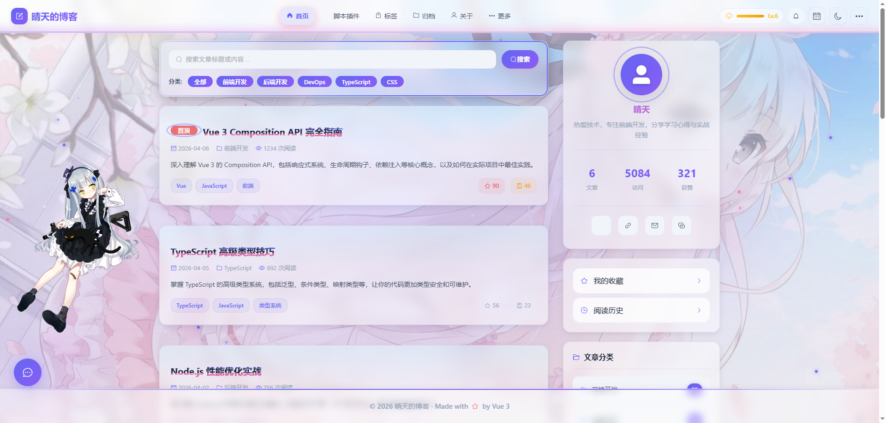

# 🚀 截图快速开始指南

## 第一步：启动博客

在项目根目录打开终端，运行：

```bash
cd d:/boke
npm run dev
```

等待启动成功，访问：http://localhost:5173

## 第二步：准备截图工具

推荐使用 **Snipaste** (https://zh.snipaste.com/)

1. 下载并安装 Snipaste
2. 按下 `F1` 截图
3. 可以直接粘贴到文件夹

## 第三步：开始截图

### 📋 必需截图（优先完成）

1. **首页** (home.png)
   - 访问：http://localhost:5173/
   - 截取整个首页
   - 保存到：`screenshots/home.png`

2. **导航栏** (header.png)
   - 截取顶部导航栏
   - 保存到：`screenshots/header.png`

3. **编辑器** (editor.png)
   - 访问：http://localhost:5173/admin
   - 截取编辑器界面
   - 保存到：`screenshots/editor.png`

4. **数据仪表板** (dashboard.png)
   - 访问：http://localhost:5173/dashboard
   - 截取整个仪表板
   - 保存到：`screenshots/dashboard.png`

5. **文章详情页** (article-detail.png)
   - 访问任意文章：http://localhost:5173/article/1
   - 截取完整文章详情
   - 保存到：`screenshots/article-detail.png`

### 🎨 特色功能截图

6. **深色模式** (dark-mode.png)
   - 点击主题切换按钮，切换到深色模式
   - 截取首页或任意页面
   - 保存到：`screenshots/dark-mode.png`

7. **护眼模式** (eye-care-mode.png)
   - 打开更多菜单，开启护眼模式
   - 截取效果
   - 保存到：`screenshots/eye-care-mode.png`

8. **Live2D** (live2d.png)
   - 右下角找到 Live2D 角色
   - 截取看板娘
   - 保存到：`screenshots/live2d.png`

### 📊 数据图表截图

9. **趋势图** (trend-chart.png)
   - 在仪表板页面
   - 截取阅读趋势图
   - 保存到：`screenshots/trend-chart.png`

10. **时段分布** (time-chart.png)
    - 在仪表板页面
    - 截取时段分布图
    - 保存到：`screenshots/time-chart.png`

### 📱 其他页面截图

11. **归档页** (archives.png)
    - 访问：http://localhost:5173/archives
    - 截取归档页面
    - 保存到：`screenshots/archives.png`

12. **标签页** (tags.png)
    - 访问：http://localhost:5173/tags
    - 截取标签页面
    - 保存到：`screenshots/tags.png`

13. **移动端** (mobile.png)
    - 按 F12 打开开发者工具
    - 点击设备工具栏图标（Ctrl+Shift+M）
    - 选择 iPhone 或 Android 设备
    - 截取移动端视图
    - 保存到：`screenshots/mobile.png`

## 第四步：更新文章

截图完成后，修改 `CSDN_ARTICLE.md` 文件中的图片路径：

```markdown
# 原来的路径（示例）


# 发布到 CSDN 时，需要上传图片并替换为 CSDN 的图片链接
```

## 截图检查清单

- [ ] 启动开发服务器成功
- [ ] 访问 http://localhost:5173 正常
- [ ] 准备好截图工具
- [ ] 截取首页 (home.png)
- [ ] 截取导航栏 (header.png)
- [ ] 截取编辑器 (editor.png)
- [ ] 截取数据仪表板 (dashboard.png)
- [ ] 截取文章详情 (article-detail.png)
- [ ] 截取深色模式 (dark-mode.png)
- [ ] 截取护眼模式 (eye-care-mode.png)
- [ ] 截取 Live2D (live2d.png)
- [ ] 截取趋势图 (trend-chart.png)
- [ ] 截取时段分布 (time-chart.png)
- [ ] 截取归档页 (archives.png)
- [ ] 截取标签页 (tags.png)
- [ ] 截取移动端 (mobile.png)
- [ ] 所有截图都已保存到 screenshots 文件夹
- [ ] 检查截图质量清晰

## 常见问题

### Q: 截图应该多大？
A: 宽度建议 1200px-1600px，高度根据内容调整。使用 Snipaste 可以选择区域大小。

### Q: 截图格式用什么？
A: 推荐使用 PNG 格式，质量更好，文件大小建议控制在 500KB 以内。

### Q: 如何截取移动端效果？
A: 在浏览器按 F12，然后按 Ctrl+Shift+M 切换到移动端视图。

### Q: 需要截取所有20张吗？
A: 建议至少完成前13张核心截图，其他可以根据需要补充。

### Q: 截图时需要登录吗？
A: 不需要，所有功能都可以直接访问。

## 截图技巧

1. **保持一致性**：所有截图使用相同的浏览器缩放比例（100%）
2. **清理干扰**：关闭浏览器扩展，避免影响截图效果
3. **加载完成**：确保页面完全加载后再截图
4. **交互效果**：对于下拉菜单、悬停效果，可以先触发再截图
5. **对比效果**：深色模式和浅色模式可以截同一位置，便于对比

## 下一步

截图完成后：

1. 将 `CSDN_ARTICLE.md` 的内容复制到 CSDN
2. 将截图上传到 CSDN 图床
3. 替换文章中的图片链接为 CSDN 的图片地址
4. 发布文章！

---

**需要更多帮助？** 查看详细的 `SCREENSHOT_GUIDE.md` 文档。
